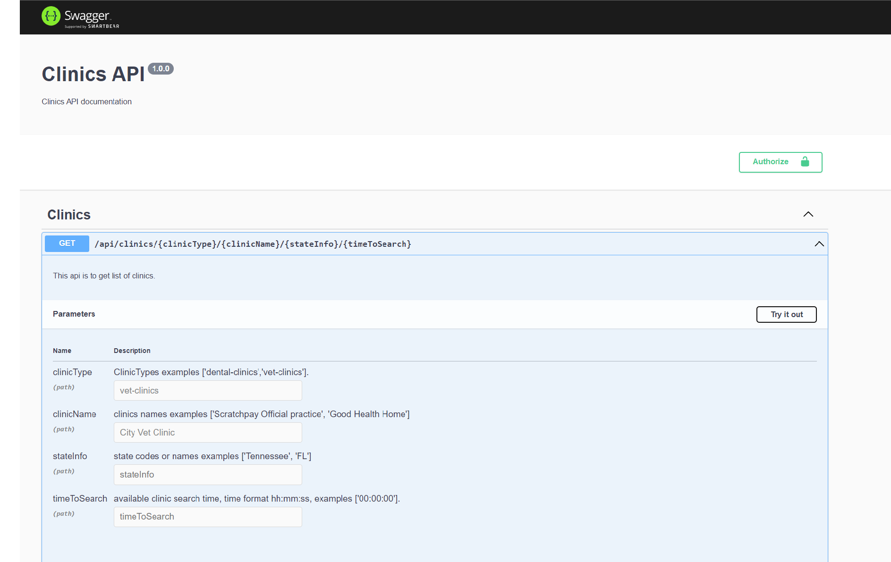
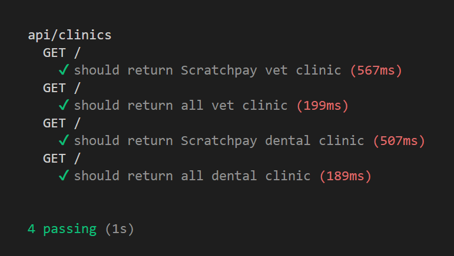
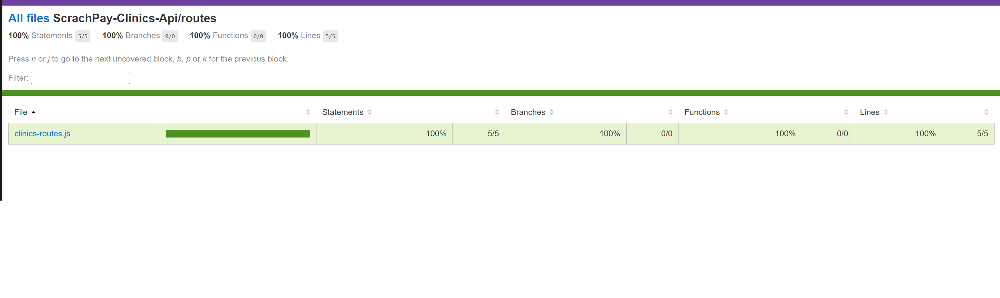

# Clinics Apis
> A simple restful API to get clinics with expressJS and Swaggers Docs-


[![NPM Version][npm-image]][npm-url]
[![Downloads Stats][npm-downloads]][npm-url]

This project act as a API service for Clinics App (But can be modified for any CRUD operations by modifying model and controller files).This project uses swaggers npm packages for generating swagger docs at /api-docs endpoint 



## Installation

once repo is cloned cd to project and run
```sh
npm install
```

## Development setup

To start app run command

```sh
npm start
```
and navigate to <http://localhost:8080/api-docs/>


## Usage example

Getting Clinics


## How to test?
To test this application run the application with command: "npm start" and then run command: "npm run coverage"



## Meta

Your Name – [@YourlinkedIn](https://www.linkedin.com/in/vishal-singh-694502112/) – vishal8840906676@gmail.com

[https://github.com/VishalCodingNinja](https://github.com/VishalCodingNinja/)

## Contributing

1. Fork it
2. Create your feature branch (`git checkout -b feature/fooBar`)
3. Commit your changes (`git commit -am 'Add some fooBar'`)
4. Push to the branch (`git push origin feature/fooBar`)
5. Create a new Pull Request

<!-- Markdown link & img dfn's -->
[wiki]: https://github.com/yourname/yourproject/wiki
